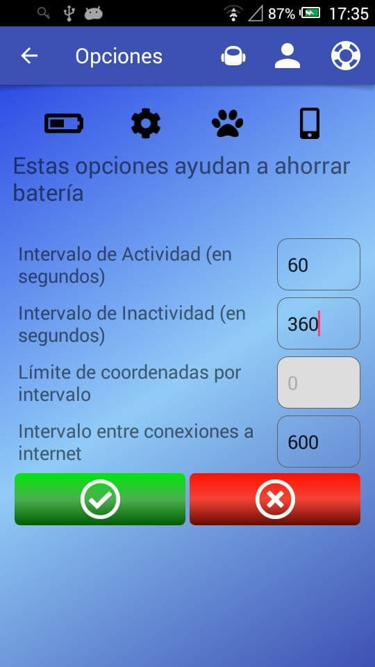
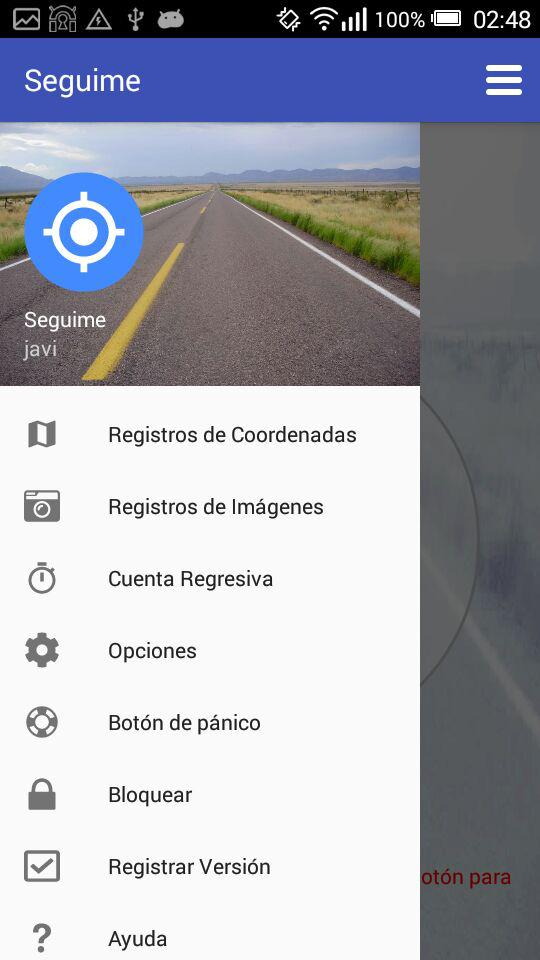
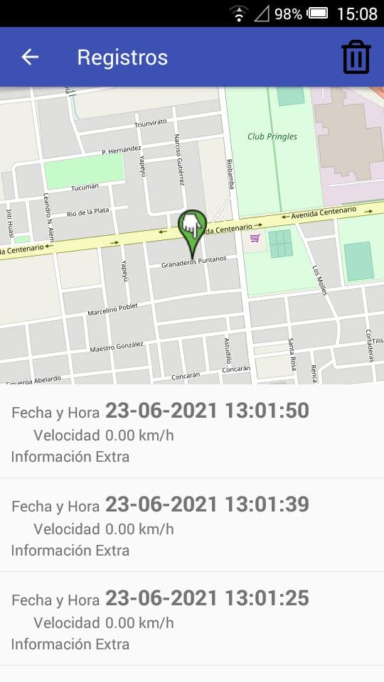
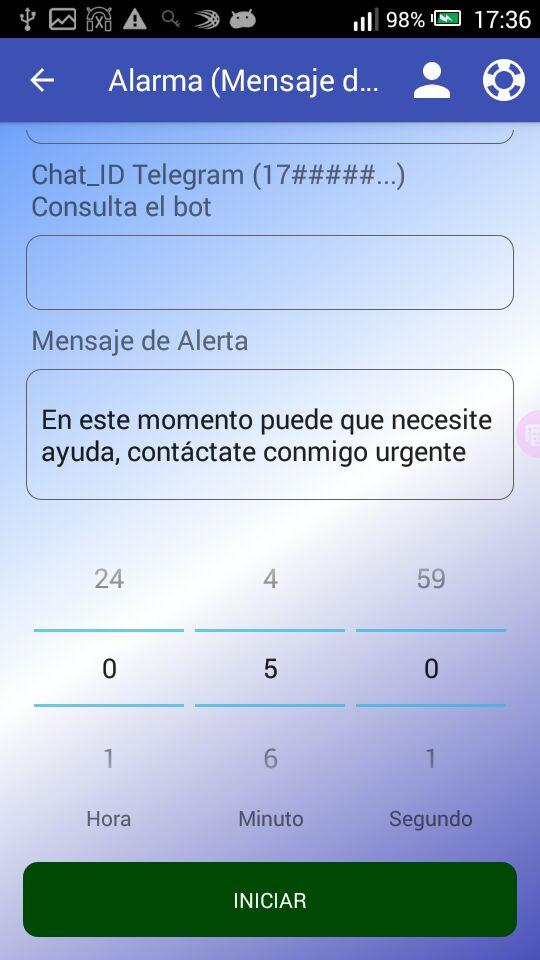
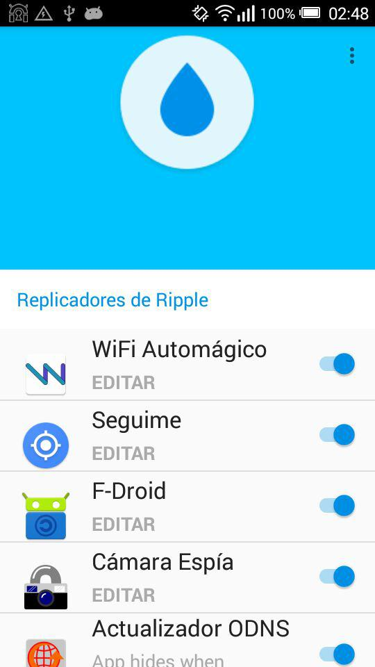
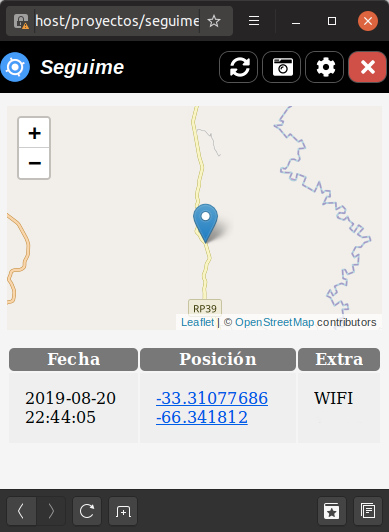

#  Seguime

Almacena coordenadas GPS y las envía a tu servidor web para poder ver donde
está tu dispositivo.

## Características:
* Envía coordenadas por Telegram (Bot) y SMS.
* Configurable desde el sitio web.
* Control sobre tiempos de actividad e inactividad para ahorrar batería.
* Temporizador para habilitar el modo de rastreo y envío de mensajes de emergencia.
* Opción para iniciar con el sistema.
* Opción para bloquear la aplicación.
* Envío de información sobre la red a la que está conectado el dispositivo.
* Conecta a redes abiertas (Requiere versión donación y la aplicación WiFi Automágico disponible en el sitio).
* Envía fotografías al servidor (Requiere versión donación y la aplicación Cámara Espía disponible en el sitio).
* Opción para activar con el botón de pánico Ripple de Guardian Project, más información en https://guardianproject.info/apps/info.guardianproject.ripple/
* Opción para activar de forma remota por SMS.

Para quienes les interesa la privacidad:
* Puedes montar tu propio servidor y compartirlo con tus amigos/familiares (Mayor privacidad).
* Mapas de Open Street Map.
* Cuentas fáciles de crear sin solicitar datos personales.
* Puedes ver el código del servidor y de la aplicación.
* No usa servicios ni recursos de Google, Amazon ni de ninguna corporación recolectora de datos.
* Eliminación de datos y cuentas de forma real (El dato se elimina verdaderamente de la base de datos, no se "oculta").
* Soporte SSL.

Es solo un proyecto, por lo tanto solo podrá usarse con fines experimentales y
no con fines de seguridad.

## Capturas

## Código del Servidor:
Si buscas el servidor, está aquí: https://gitlab.com/javipc/seguime_servidor
Está escrito en PHP.

## Donaciones

Seguime es un proyecto para localizar un dispositivo con sistema operativo Android 

* Libre de Publicidad.
* Libre de Rastreadores.
* Libre de Telemetría.
* Libre de Código Propietario.
* Libre...

Al no tener publicidad este proyecto se mantiene únicamente con donaciones.
Siguiendo este enlace tendrás más información y también más aplicaciones.
[Más información](https://gitlab.com/javipc/mas) 

## IMPORTANTE:
La versión 5.2 posee muchos cambios, introduce compatibilidad con versiones de android y un sistema de eventos mejorado. Por lo tanto deberá probar que todas las funciones trabajen y respondan correctamente.
